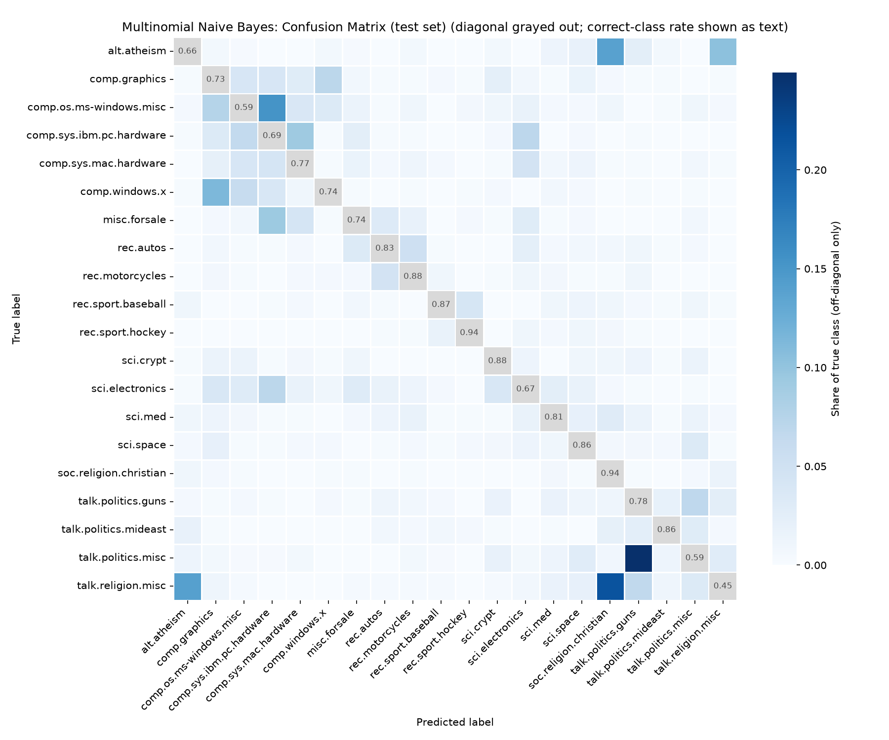
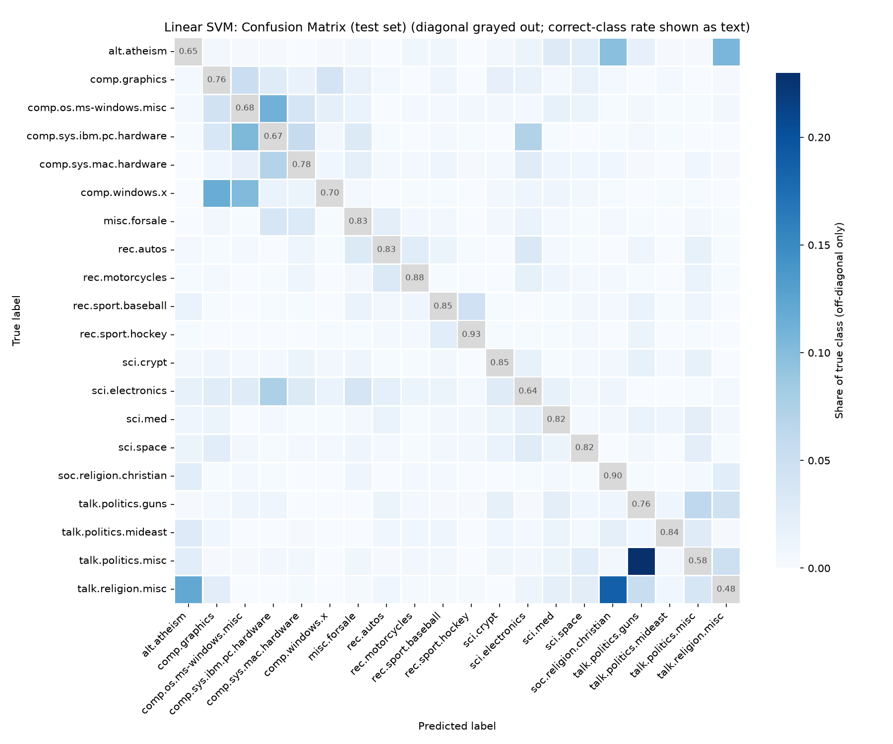
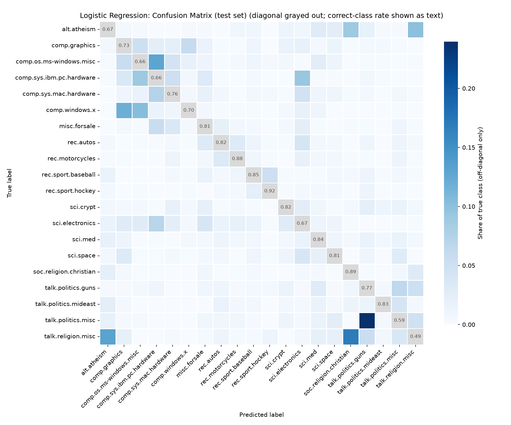

# GitHub Link
- https://github.com/EECE5644/final-project

# Methods (Machine Learning Model Implementation)
We chose three ML methods for our project: `Multinomial Naive Bayes`, `Linear SVM`, and `Logistic Regression`.
The reason we chose these three methods is that they are all well-suited for text classification tasks.

# Pipelines
Firstly, we need to preprocess the text from 20newsgroups dataset, which includes lowercasing, removing punctuation, removing numbers, removing extra spaces, tokenization, and stopwoard removal.
Secondly, we use vectorizers to convert the text into numerical features. In this step, the data also is normalized and filtered low frequency words.
Thirdly, we use grid search to determine the best hyperparameters for each model.
Finally, we evaluate the performance of each model using metrics such as accuracy, precision, recall, and F1-score.

# Preprocessing
Text preprocessing techniques: lowercasing, removing punctuation, removing numbers, removing extra spaces, tokenization, and stopwoard removal.
The code is in [preprocessing.py](../data_preprossor.py).

# Hyperparameter tuning

We tuned the hyperparameters of each model using grid search with cross-validation.
For `Multinomial Naive Bayes`, we tuned the `alpha` parameter, which controls the smoothing of the model.
For `Linear SVM`, we tuned the `C` parameter, which is inversely related to the regularization strength of the model.
For `Logistic Regression`, we also tuned the `C` parameter, which controls the regularization strength of the model.

| Model | Best Params |
|---|---|
| Multinomial Naive Bayes | alpha=0.01 |
| Linear SVM | C=1 |
| Logistic Regression | C=10 |

# Performance Evaluation

Model comparison on 20 Newsgroups (TF-IDF features, 5-fold CV grid search).

| Model | Best Params | CV Accuracy | Test Accuracy | Precision | Recall | F1 |
|---|---|---|---|---|---|---|
| Multinomial Naive Bayes | alpha=0.01 | 0.8653 | 77.34% | 0.7713 | 0.7641 | 0.7649 |
| Linear SVM | C=1 | 0.8543 | 77.00% | 0.7652 | 0.7614 | 0.7618 |
| Logistic Regression | C=10 | 0.8478 | 76.65% | 0.7624 | 0.7583 | 0.7590 |

*Naive Bayes* performs best across all test metrics.

# Visualizations

# Feature Importance
The features of our model are every unique tokenized word in our sample. The category-specific words contributes the most to the predictions. For example, "nasa", "orbit", "moon", and so on features are the strongest predictors for sci.space category, and "nhl", "cup", "playoffs", and so on are the most contributed features to the prediction in rec.sport.hockey category. "ploygon", "animation", "tiff", "3d", and so one are featires are the strongest predictors for comp.graphics categories.

However, the generic words ("people", "time", "thanks", "years" etc) or rarely used words ("rutgers", "1993apr20") have little or no impact on prediction.

The model performance changes when different feature combinations are used. If we use too small number of features, accuracy will drop because many important/meaningful discriminative words will be missing. If we use too many number of features, accuracy will also be reduced due to overfitting or noise (too much impact from generic/rare words). Thus, it is important to find the proper scale of features or feature engineering to avoid these problem.

# Discussion and interpretation of the results
The most important insights obtained from the machine learning model is which features are the most discriminature words to categorize the post/writings ("nasa", "orbit", "nhl", "mac", etc). We also found that we need to set the feature sizes and feature selection carefully to get the high accuracy in our model (Not just smaller/larger size of features are good).

The predictions are meaningful for the application domain because the model can predict/classify the newspost/document into categories with reliable accuracy with the meaningful discriminative words that are assiciated with each categories. This means the model can predict based on reasonable judgement, and it can be used in application domain.

The strenghs of my model is that coefficients reveal which words matter most and it is fast to run with the large dataset compared to other models we tested. Also, the accuracy of the model is the highest in three models we tested (Logistic Regression, Linear SVM, Multinomial Naive Bayes). The limitations of my model is that it ignores the word order, which can reduce the accuracy. Another limitation (it can probably be the preprocessing step problem, or also the model issue) is that it can't exclude the generic words.

There are also the limitations exist in the dataset because some categories share many vocabulary, which makes classification between these categories difficult. Also, the dataset is created in 1999, so words can be little outdated to classify the newspapers of recent years (2020s). Additionally, categories we used for training doesn't cover enough topic field to classify every newspapers (e.g. health, and so on).

If we collect more recent newspost for out dataset, it can improve relevance. Also, adding more newspost with more various newsgroup categories can help increasing the accuracy of the model and can cover more types of newspost for prediction.

We can apply this predictive model in a real-world setting to categorize the post type (create tag automatically for the post like the tag in instagram) and filtering the inappropritate post/comment to automatically remove the negative writings/post/comment in youtube or any other platforms.

# Anwswers to yout selected research questions (Model Evaluation and Analysis)
- Which machine learning algorithm produced the best performance?
    - When we tested the performance of algorithm across Logistic Regression, Linear SVM, and Multinomial Naive Bayes, the Multinomial Naive Bayes algorithm produced the best performance in accuracy and cross-validation(CV) accuracy.
- Which algorithm achieved the best balance between accuracy, precision, recall, and F1-score?
    -  Multinomial Naive Bayes algorithm achieved the best balance between accuracy, precision, recall, and F-1 score because Naive Bayes algorithm has the highest scores in all these 4 sections and shows the most consistent balance across all metrics although other two models are close behind.
- Which evaluation metric is the most appropriate for your problem, and why?
    - We used accuracy, precision, recall, and F-1 score for our evaluation metrics (all of them can be used to evaluate the classification model), but the most appropriate evaluation metrics for our problem is F1 score because it balances both precision and recall.
- What does the confusion matrix reveal about false positives and false negatives?
    - False positive reveals that the model predicts the wrong category when vocabulary overlaps. False negative reveals that the model can't find the correct category when distinctive words are absent or not clear.
- Which model minimizes critical prediction errors (for example, false negatives in healthcare applications)?
    - Linear SVM tends to reduce false negatives slightly more than Naive Bayes (only for false negative part), but Naive Bayes minimizes the critical prediction errors best overall in our dataset.
- How well does the final model generalize to unseen test data?
    -  We got 77% accuracy and 86% CV accuracy for the final model, which indicates out model generalized good for unseen test data. Misclassifications mostly occur in overlapping categories, which is dataset issue, not the model issue.
- Did hyperparameter tuning improve the model's performance?
    - Yes, we used grid search to to tune the best hyperparamer for each models. We observed that tuning hyperparameter improves the model's croos-validation accuracy (model's performace) than default setting.
- How does feature selection affect the final results?
    - Too few features can lead to underfiitting (accuracy decreases due to missing discriminative words). Too many features can lead to overfitting (accuracy decreases due to too many noise).
- If there's news that contains the features of multiple newsgroups and can be considered to be in multiple newsgroups, how model treat this type of news document?
    - The model is forced to assign in one category, so the model will predict the category with the highest probability (considering the numbers of discrimivative words in specific category) to assign the category for the news document that contains features from multiple newsgroups.
- Are the 20 newsgroups proper to classify the type of news, too much, or too small?
    - 20 newsgroups are too samll to classify the type of news because it doesn't cover every topics in general and some categories in 20 newsgroups are categorized too specifically, so shared vocabulary between similar categories reduces the prediction accuracy.
