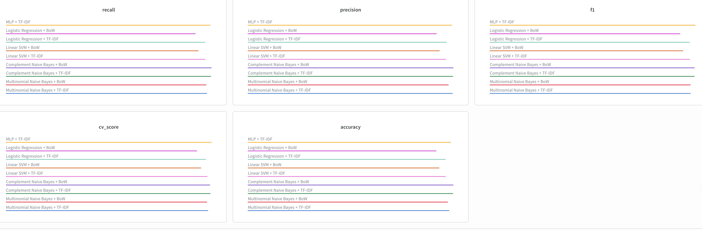

# Note
- This are documentation for iteration 5, which follws the instructions in iteration 5.

# GitHub Link
- https://github.com/EECE5644/final-project

# Machine Learning Model
- Codes for implementing machine learning model is in python code files (e.g. moels.py, vectorizers.py, baseline.py, etc)
- The final model we chose was Linear SVM + TF-IDF, which has highest/reliable overall performance across Multinomial Naive Bayes with Bag-of-Words (BoW) features/TF-IDF features, Complement Naive Bayes with BoW features/TF-IDF features, Logistic Regression with BoW features/TF-IDF features, Linear SVM with BoW features/TF-IDF features, MLP (Multi-Layer Perceptron) with BoW features/TF-IDF features, BiLSTM (Bidirectional LSTM) with learned embeddings/bag of embeddings + learned embeddings.

# Model Evaluation
- We used accuracy, precision, recall, and F-1 score for our evaluation metrics. 

- If we only consider the metrics, complement Naive Bayes + TF‑IDF and MLP + TF‑IDF achieved the high and best balance between accuracy, precision, recall, and F1-score. However, If we consider metric balance, overall accuracy, and consistency in strong correct‑class rates on across categories, linear SVM + TF-IDF has the best performance. 

# Visualizations
- Visualizations are saved in attachments directory. Path given for this directory is start from the root. (Path: /attachments)

# Research Questions (Changed little from iteration 1)
- What insights were obtained from the data?
    - The most important insights obtained from the machine learning model is which features are the most discriminature words to categorize the post/writings ("nasa", "orbit", "nhl", "mac", etc). We also found that we need to set the feature sizes and feature selection carefully to get the high accuracy in our model (Not just smaller/larger size of features are good).
- Which machine learning algorithm produced the best performance? 
    - When we tested the performance of algorithm across Multinomial Naive Bayes with Bag-of-Words (BoW) features/TF-IDF features, Complement Naive Bayes with BoW features/TF-IDF features, Logistic Regression with BoW features/TF-IDF features, Linear SVM with BoW features/TF-IDF features, MLP (Multi-Layer Perceptron) with BoW features/TF-IDF features, BiLSTM (Bidirectional LSTM) with learned embeddings/bag of embeddings + learned embeddings, the Linear SVM with TF‑IDF features produced the best overall performance especially considering metric balance, overall accuracy, and consistency in strong correct‑class rates on across categories.
- Which algorithm achieved the best balance between accuracy, precision, recall, and F1-score?
    - Only consider the metrics, complement Naive Bayes + TF‑IDF and MLP + TF‑IDF achieved the high and best balance between accuracy, precision, recall, and F1-score.
- Which evaluation metric is the most appropriate for your problem, and why?
    - We used accuracy, precision, recall, and F-1 score for our evaluation metrics (all of them can be used to evaluate the classification model), but the most appropriate evaluation metrics for our problem is F1 score because it balances both precision and recall. (highest accuracy, strong precision, high recall, balanced f-1 score)
- What does the confusion matrix reveal about false positives and false negatives?
    - False positive reveals that the model predicts the wrong category when vocabulary overlaps. False negative reveals that the model can't find the correct category when distinctive words are absent or not clear.
- Which model minimizes critical prediction errors (for example, false negatives in healthcare applications)?
    - Complement Naive Bayes + TF‑IDF is the strongest candidate because it consistently balances recall and precision while reducing false negatives.
- How well does the final model generalize to unseen test data?
    - We got 77% accuracy and 86% CV accuracy for the final model, which indicates out model generalized good for unseen test data. Misclassifications mostly occur in overlapping categories, which is dataset issue, not the model issue.
- Did hyperparameter tuning improve the model's performance?
    - Yes, we used grid search to to tune the best hyperparamer for each models. We observed that tuning hyperparameter improves the model's croos-validation accuracy (model's performace) than default setting.
- Which features contributed most to the predictions?
    - The features of our model are every unique tokenized word in our sample. The category-specific words contributes the most to the predictions. For example, "nasa", "orbit", "moon", and so on features are the strongest predictors for sci.space category, and "nhl", "cup", "playoffs", and so on are the most contributed features to the prediction in rec.sport.hockey category. "ploygon", "animation", "tiff", "3d", and so one are featires are the strongest predictors for comp.graphics categories.
- How does feature selection affect the final results?
    - Too few features can lead to underfiitting (accuracy decreases due to missing discriminative words). Too many features can lead to overfitting (accuracy decreases due to too many noise).
- If there's news that contains the features of multiple newsgroups and can be considered to be in multiple newsgroups, how model treat this type of news document?
    - The model is forced to assign in one category, so the model will predict the category with the highest probability (considering the numbers of discrimivative words in specific category) to assign the category for the news document that contains features from multiple newsgroups.
- Are the 20 newsgroups proper to classify the type of news, too much, or too small?
    - 20 newsgroups are too samll to classify the type of news because it doesn't cover every topics in general and some categories in 20 newsgroups are categorized too specifically, so shared vocabulary between similar categories reduces the prediction accuracy.

# Discussion
- Key Findings
    - Multinomial Naive Bayes with TF-IDF also has a strong performance, but linear SVM with TF-IDF has the most consistent correct-class rates across categories.
    - Deep learning models showed competitive results, but did not consistently perform stronger than simple linear models.
    - Categories with overlapping vocabulary (e.g. politics-related groups) had higher misclassification rates across all models.
- Strengths of the model is that it has a high accuracy and reliability across many topics. Also, linear SVM with TF-IDF model has a strong generalization to unseen data compared to other models.
- Limitations exist in both model and dataset side. For dataset side, some categories share many vocabulary, which makes classification between these categories difficult. Also, the dataset is outdated (created 27 years ago), so words can be little outdated to classify the newspapers of recent years (2020s). For the model side, ctegories we used for training doesn't cover every general news topic to classify every newspapers (e.g. health, and so on). Performance varies across topic (this might due to wrong category choice).
- Source of errors are overlapping word usage between categories (many shared vocabulary in multiple categories) and amibiguous posts that could reasonably fit to multiple categories (due to too specialized & similar categories).
- Some ethical considerations are if there's some information is misclassified, the wrong information can be provided to people. Also, there's the risk of bias on classification if training data contains stereotypes.
- We can improve out model by removing the too specialized/similar categories to avoid the case the share of many discriminative vocabulary under multiple similar topics. We can add new categories that cover general news topic, but not covered by original 20 newsgroups. We also can add recent news posts in samples to cover neologism for prediction.

# Real-World Application
- We can use this trained model to .....
    - Categorize the post type (e.g. creating tag automatically for the post like the tag in instagram/Tic-Tok)
    - Filter spam in email
    - Filter the inappropriate post/comment to automatically remove the negative post/comment in youtube or any other platforms
    - and much more
- Social media platforms and email providers can benefit from this model by applying this model to their service. The user who uses these media platforms/email can also benefit from this provided service. 
- For deployment challenges, since new vocabulary (Neologism) and topic created over time, so we need to train the model again regularly to update these recent vocabulary/trends. We also need to find approprite number of news document categories to cover majority news document topics and how detail the category should be. 